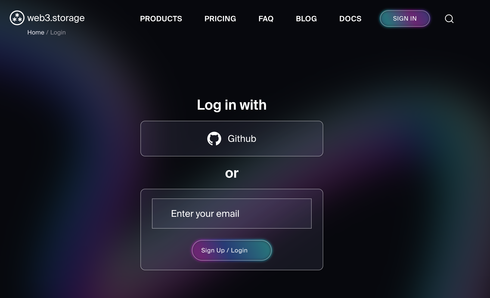
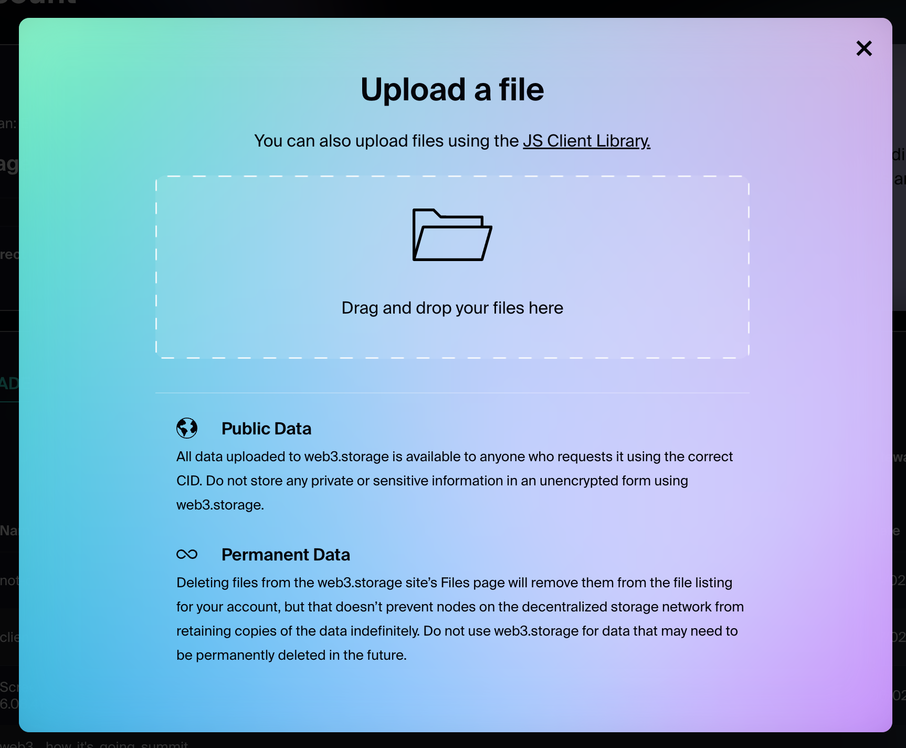

# Publish a file with IPFS

In this quickstart guide, you will learn about [pinning services](../concepts/persistence.md#pinning-in-context) and how to use them to publish content-addressed data with IPFS. To learn the process, you will upload the file to a pinning service called [web3.storage](https://web3.storage/). By the end of this guide, you should have a better understanding of how content addressing and CIDs work from a high level.

:::callout
The web3.storage pinning service was chosen purely for demonstration purposes, and is one of many [pinning services](../concepts/persistence.md#pinning-in-context) you can choose from. While each pinning services has different SDKs and APIs, their fundamental role is the same - to store files and make them available to the IPFS network. In fact, one of the main benefits of IPFS is that files can be pinned to multiple pinning services, thereby reducing vendor lock-in.
:::

## Contents <!-- omit from toc -->

- [Pinning overview](#overview)
- [Prerequisites](#prerequisites)
- [Uploading and pinning a file](#uploading-and-pinning-a-file)
- [CIDs explained](#cids-explained)
- [Summary and next steps](#summary-and-next-steps)

## Overview

_Pinning_ refers to the process of ensuring that a particular piece of content is retrievable with IPFS. In other words, pinning is equivalent to storing a file on a computer or server that is connected to the internet, thereby making it available to the rest of the IPFS network.

Pinning can be done at various levels, from individual files to entire directories that are addressed by a CID. You can also pin CIDs to multiple IPFS nodes to increase the redundancy and resilience of the file on the network.

### Pinning services

[Pinning services](../concepts/persistence/#pinning-services) are similar to hosting services, in that they run an IPFS node for you and ensure that your files are available to the IPFS network.

:::callout
Data pinned to the IPFS network is public by default and retrievable by anyone. Avoid publishing private data or adequately encrypt it before publishing.
:::

## Prerequisites

- A free [web3.storage](https://web3.storage/) account.
- The [following image](/images/welcome-to-IPFS.jpg), downloaded and saved on your computer:


## Uploading and pinning a file

1. Sign into your account on web3.storage.

   

1. After logging in, click on **Upload files** to open the upload tab.

   

1. Upload and pin the file by doing either dragging the [image file](/images/welcome-to-IPFS.jpg) to the dashed rectangle labeled **Drag and drop your files here**, or clicking on the dashed rectangle to select the [image](/images/welcome-to-IPFS.jpg) file.

   

   Once the file has been successfully uploaded, the following displays:

   

   If you close the upload tab, you should also be able to see a shortened **Content Identifier (CID)** of the uploaded image, **`bafyb...d32wm3q4`**, similar to the image below:

   

Congratulations, you have successfully **pinned** a file to IPFS! 🎉

Let's unpack what just happened, by looking at CIDs.

## CIDs explained

In IPFS, every file and directory is identified with a Content Identifier ([CID](../concepts/content-addressing.md)). The CID serves as the **permanent address** of the file and can be used by anyone to find it on the IPFS network.

When a file is first added to an IPFS node (like the image used in this guide), it's first transformed into a content-addressable representation in which the file is split into smaller chunks (if above ~1MB) which are linked together and hashed to produce the CID.

In this guide, the CID for the uploaded image is:

```plaintext
bafybeicn7i3soqdgr7dwnrwytgq4zxy7a5jpkizrvhm5mv6bgjd32wm3q4
```

You can now share the CID with anyone and they can fetch the file using IPFS.

To dive deeper into the anatomy of the CID, check out the [CID inspector](https://cid.ipfs.tech/#bafybeicn7i3soqdgr7dwnrwytgq4zxy7a5jpkizrvhm5mv6bgjd32wm3q4)

:::callout
The transformation into a content-addressable representation is a local operation that doesn't require any network connectivity. With web3.storage, this transformation happens client-side (in the browser).
:::

## Retrieving with a gateway

Now that your file is pinned to a pinning service, you will fetch it using an IPFS gateway. An [**IPFS Gateway**](/concepts/ipfs-gateway/) is an HTTP interface that serves as a bridge to the IPFS network. In other words, it allows you to fetch CIDs from IPFS using HTTP.

Pinning services typically offer an IPFS gateway as a way to easily retrieve your CIDs. For example, Web3.storage operates the [w3s.link](https://w3s.link) gateway, from which you can retrieve the uploaded CID.

To retrieve the CID, open the following URL:
[bafybeicn7i3soqdgr7dwnrwytgq4zxy7a5jpkizrvhm5mv6bgjd32wm3q4.ipfs.w3s.link](https://bafybeicn7i3soqdgr7dwnrwytgq4zxy7a5jpkizrvhm5mv6bgjd32wm3q4.ipfs.w3s.link/)

:::callout
When pinning a file to IPFS, the filename is not stored by default. To ensure the filename is retained, it's common to wrap the file in a directory. In such instances, both the file and the directory will have unique CIDs. Web3.storage wraps files in a directory by default, which is why you see a directory listing with the file `welcome-to-IPFS.jpg` followed by a shorthand CID: `bafk…beom` of the file.
:::

## Summary and next steps

In this quickstart guide, you learned about [pinning services](../concepts/persistence.md#pinning-in-context), and how to use them to publish content-addressed data with IPFS. You also learned how CIDs address files and directories in IPFS by uploading a file to a pinning service called [web3.storage](https://web3.storage/).

Pinning services provide a convenient alternative to running IPFS nodes and infrastructure. However, the two are not mutually exclusive; you can combine a pinning service with an IPFS node on your computer to increase the resilience of your CIDs.

Possible next steps include:

- Check out [the lifecycle of data in IPFS](../concepts/lifecycle.md) to learn more about how publishing by pinning fits into the full lifecycle of data in IPFS.
- Try fetching the pinned file by following the [retrieval quickstart](./retrieve.md).
- If you prefer to upload a file programmatically with JavaScript or Go, check out the [Web3.storage docs](https://web3.storage/docs/how-tos/store/).
- Alternatively, try out [Filebase](https://filebase.com/), a pinning service that offers an [AWS S3-compatible API for pinning](https://docs.filebase.com/getting-started/s3-api-getting-started-guide), so you can use any S3-compatible SDK, e.g. [aws-sdk](https://www.npmjs.com/package/aws-sdk), and [many](https://github.com/s3tools/s3cmd) more.
